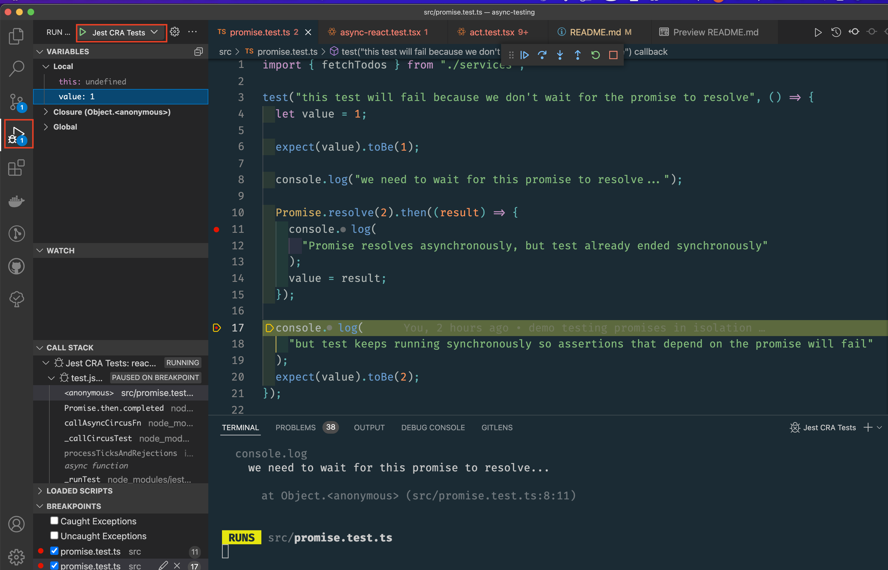

# Async Testing

This repo contains example tests to demonstrate how to test handling async UI updates in React components

# TLDR

- Use react testing library, which [automatically wraps all renders and events in act](https://testing-library.com/docs/preact-testing-library/api/#act)
- You rarely if ever need to use `act`. More Info:
  - https://twitter.com/kentcdodds/status/1330937800321974272?lang=en
  - https://kentcdodds.com/blog/fix-the-not-wrapped-in-act-warning
  - https://javascript.plainenglish.io/you-probably-dont-need-act-in-your-react-tests-2a0bcd2ad65c
  - https://davidwcai.medium.com/react-testing-library-and-the-not-wrapped-in-act-errors-491a5629193b
- Use [react testing library async utils](https://testing-library.com/docs/dom-testing-library/api-async/) instead (`waitFor`, `findByText`, etc.)

# Video recordings of the presentations

Watch the videos below and follow along in the code:

- [Part 1](https://drive.google.com/file/d/1OQLEfXyxQFoRXeUvKl66pvj6R_Dk33wN/view)
- [Part 2](https://drive.google.com/file/d/1K9q0GGOt2N5vK5P0Gyc1OaOqO0XtBpOP/view)

# Running the tests

- `git clone` this repo
- `npm install` once to setup `node_modules`
- Add a `.only` to the test you want to run (`test.only`) so the console isn't cluttered by other tests
- `npm test`
- Start with `promise.test`, which demonstrates testing promises in isolation
- The tests are designed to be self-documenting and read through top to bottom building on concepts demonstrated in earlier tests
- Move on to `async-react.test` which demonstrates setting up assertions for UI updates in React components that happen async
- Move on to `act.test` to learn more about why it's rarely necessary

# Setting breakpoints in the tests

- Open in VS Code and click the "run and debug" icon on the sidebar
- Open test file you want to run and click green play icon for "Jest Current File" OR run "Jest CRA Tests"
  

# Async/Await Syntax

This is a good tutorial to get more comfortable with async/await syntax for working with promises:
https://javascript.info/async-await

# Mastering the Event Loop, Microtasks, Macrotasks, etc.

If these terms are fuzzy to you, the good news is you don't really have to understand them if you use react testing library's async utils such as `waitFor`. They allow you to think about your test from a user's perspective (ie this data takes a little bit to appear after I click this button). If you're curious and would like to deepen your understanding, I have found these resources to be extremely helpful:

- [What the heck is the event loop anyway? | Philip Roberts | JSConf EU](https://www.youtube.com/watch?v=8aGhZQkoFbQ&t=1s&ab_channel=JSConf)
  - [demo app from talk](http://latentflip.com/loupe/?code=JC5vbignYnV0dG9uJywgJ2NsaWNrJywgZnVuY3Rpb24gb25DbGljaygpIHsKICAgIHNldFRpbWVvdXQoZnVuY3Rpb24gdGltZXIoKSB7CiAgICAgICAgY29uc29sZS5sb2coJ1lvdSBjbGlja2VkIHRoZSBidXR0b24hJyk7ICAgIAogICAgfSwgMjAwMCk7Cn0pOwoKY29uc29sZS5sb2coIkhpISIpOwoKc2V0VGltZW91dChmdW5jdGlvbiB0aW1lb3V0KCkgewogICAgY29uc29sZS5sb2coIkNsaWNrIHRoZSBidXR0b24hIik7Cn0sIDUwMDApOwoKY29uc29sZS5sb2coIldlbGNvbWUgdG8gbG91cGUuIik7!!!PGJ1dHRvbj5DbGljayBtZSE8L2J1dHRvbj4%3D)
- https://jakearchibald.com/2015/tasks-microtasks-queues-and-schedules/
- https://javascript.info/event-loop
- https://javascript.info/microtask-queue
